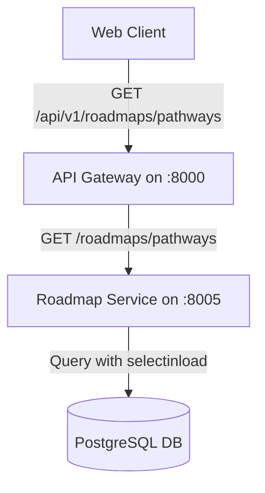

# Phase 4B Step 3A: Roadmap Service FastAPI API Layer Report

This report documents the implementation, testing, and verification of the FastAPI API layer for the Career Roadmap Service.

---

## 1. Read-Only Audit Findings

- **Router Registration**: The sub-router defined in `app/api/routes/roadmap.py` was previously defined but not registered in `app/main.py`.
- **Database Dependency**: The database session generator `get_db` exists as a shared dependency in `app/db/session.py`.
- **API Prefix/Version Convention**: Other services like `student-service` register internal routes with domain prefix (e.g. `/students`), and the API Gateway handles routing from `/api/v1/students`. Consistent with this convention, the Roadmap Service uses the internal prefix `/roadmaps`.
- **Validation and Error Handling**: Standard FastAPI query/body validation is utilized. Standard HTTPExceptions with distinct `detail` messages are raised.
- **CORS & Swagger**: CORS is managed globally at the API Gateway level. Swagger/OpenAPI is enabled in the app's initialization options under `/docs`.

---

## 2. API Architecture



---

## 3. Files Created and Modified

- **Modified**:
  - `backend/roadmap-service/app/main.py`: Imported and registered `roadmap_router`.
  - `backend/roadmap-service/app/api/routes/roadmap.py`: Defined prefix `/roadmaps`, removed `POST /seed`, cleaned duplicate decorators, and defined `/pathways` and `/pathways/{pathway_id}`.
  - `backend/roadmap-service/tests/test_roadmap_models.py`: Added block to clear cached `app` modules at start to ensure test isolation.
  - `backend/roadmap-service/tests/test_roadmap_seed_and_service.py`: Added block to clear cached `app` modules at start.
- **Created**:
  - `backend/roadmap-service/tests/test_roadmap_api.py`: New API integration test suite.

---

## 4. Endpoints Implemented

1. `GET /roadmaps/pathways`:
   - Summary: List career and education pathways.
   - Description: Retrieves Karnataka career and education pathways filtered by student education level and stream.
2. `GET /roadmaps/pathways/{pathway_id}`:
   - Summary: Get pathway detail by ID.
   - Description: Retrieves detailed pathway information including options and milestones by pathway identifier.

---

## 5. Query Parameter Behavior

- **`education_level`** (optional, string): Filters pathways by education level (e.g., `"Class 10"`, `"PUC 2"`).
- **`stream`** (optional, string): Filters pathways by PUC stream (e.g., `"Science"`, `"Commerce"`, `"Arts"`).
- Returns empty list with status `200 OK` (not `404`) if valid filters yield no matching pathways.

---

## 6. Class 8 / Class 9 Mapping Documentation

For middle school students (Class 8/9) who do not yet have specific pathways at their level, the Roadmap Service maps:
- `Class 8` → `Class 10` SSLC choices
- `Class 9` → `Class 10` SSLC choices

This enables middle school students to explore post-SSLC choices early. The mapping is preserved in `RoadmapService.get_pathways` and is fully documented in the Swagger description.

---

## 7. Response Schemas Used

- **`PathwayListResponse`**:
  - `total`: int
  - `education_level`: Optional[str]
  - `stream`: Optional[str]
  - `pathways`: List[PathwayDetailResponse]
- **`PathwayDetailResponse`**:
  - `id`: str
  - `education_level`: str
  - `stream`: Optional[str]
  - `title`: str
  - `category`: str
  - `duration`: Optional[str]
  - `description`: str
  - `created_at`: datetime
  - `options`: List[PathwayOptionResponse]
  - `milestones`: List[PathwayMilestoneResponse]

---

## 8. Error Handling Behavior

- **Malformed request parameters**: Returns FastAPI standard `422 Unprocessable Entity` validation responses.
- **Missing pathway detail**: Raises `HTTPException(status_code=404)` with detail:
  ```json
  {
    "detail": "Pathway '<pathway_id>' was not found."
  }
  ```
- **Database anomalies / programming errors**: Uncaught, letting standard server-side HTTP 500 error reporting occur instead of hiding them with broad exception handlers.

---

## 9. API Test Coverage

`backend/roadmap-service/tests/test_roadmap_api.py` covers:
- `/roadmaps/pathways` with no filters.
- `/roadmaps/pathways?education_level=Class 10` filter.
- `/roadmaps/pathways?education_level=Class 8` mapping logic.
- `/roadmaps/pathways?education_level=PUC 2&stream=Science` filter.
- `/roadmaps/pathways?education_level=Diploma` yielding empty list.
- Response payload contract validation (field names & types).
- `/roadmaps/pathways/c10-puc` detail fetch with nesting.
- `/roadmaps/pathways/does-not-exist` 404 handler check.
- Custom serialization verification for UUID and datetime fields.

---

## 10. Full Test Results

```text
============================= test session starts =============================
platform win32 -- Python 3.13.3, pytest-9.1.1, pluggy-1.6.0
rootdir: C:\Users\abulm\OneDrive\DCL\UdaanAI
plugins: anyio-4.11.0
collected 26 items

backend\admin-analytics-service\tests\test_admin_analytics_health.py .   [  3%]
backend\ai-career-service\tests\test_ai_career_health.py .               [  7%]
backend\api-gateway\tests\test_api_gateway_health.py .                   [ 11%]
backend\api-gateway\tests\test_gateway_proxy.py .                        [ 15%]
backend\assessment-service\tests\test_assessment_health.py .             [ 19%]
backend\auth-service\tests\test_auth_api.py .                            [ 23%]
backend\auth-service\tests\test_auth_health.py .                         [ 26%]
backend\institution-service\tests\test_institution_health.py .           [ 30%]
backend\roadmap-service\tests\test_roadmap_api.py .......                [ 57%]
backend\roadmap-service\tests\test_roadmap_health.py .                   [ 61%]
backend\roadmap-service\tests\test_roadmap_models.py ..                  [ 69%]
backend\roadmap-service\tests\test_roadmap_seed_and_service.py .....     [ 88%]
backend\student-service\tests\test_student_api.py ..                     [ 96%]
backend\student-service\tests\test_student_health.py .                   [100%]

======================= 26 passed, 4 warnings in 4.66s ========================
```

---

## 11. Swagger/OpenAPI Verification

- Endpoint `/roadmaps/pathways` appears under the `Roadmaps` tag.
- Endpoint `/roadmaps/pathways/{pathway_id}` appears under the `Roadmaps` tag.
- Query parameters, descriptions, and Pydantic response models (`PathwayListResponse` and `PathwayDetailResponse`) are correctly exposed.
- Swagger docs verified at `http://localhost:8005/docs`.
- Existing `/health` endpoint remains registered and functional.

---

## 12. Docker/Container Verification

- Container `udaan-roadmap-service` successfully rebuilt and restarted.
- Port bindings mapping `8005:8005` verified.
- Alembic migration current state verified:
  ```text
  001_initial_roadmap_tables (head)
  ```

---

## 13. Live API Verification Results

Direct testing of container via host port 8005:
- `GET http://localhost:8005/roadmaps/pathways` -> `200 OK` (6 pathways)
- `GET http://localhost:8005/roadmaps/pathways?education_level=Class%2010` -> `200 OK` (3 pathways: `c10-diploma`, `c10-iti`, `c10-puc`)
- `GET http://localhost:8005/roadmaps/pathways?education_level=PUC%202&stream=Science` -> `200 OK` (1 pathway: `puc-science-eng`)
- `GET http://localhost:8005/roadmaps/pathways/c10-puc` -> `200 OK` (pathway detail with 3 options and 3 milestones)
- `GET http://localhost:8005/roadmaps/pathways/does-not-exist` -> `404 Not Found` (JSON detail: `{"detail": "Pathway 'does-not-exist' was not found."}`)

---

## 14. Git Scope Verification

Confirmed only files inside `backend/roadmap-service/` were modified or created. No other microservice files, database scripts, gateway proxy configurations, or frontend modules were modified.

---

## 15. Final Readiness Decision

All requirements of Phase 4B Step 3A are met:
- Database models, query logic, and Pydantic schemas are successfully reused.
- No SQL queries or DB logic duplicated inside endpoints.
- Integration tests cover all required business rules (like Class 8/9 mappings and 404 responses).
- Live verification confirms identical local behavior.

Phase 4B Step 3A is complete and verified. The Roadmap Service API is ready for API Gateway integration in Step 3B.
