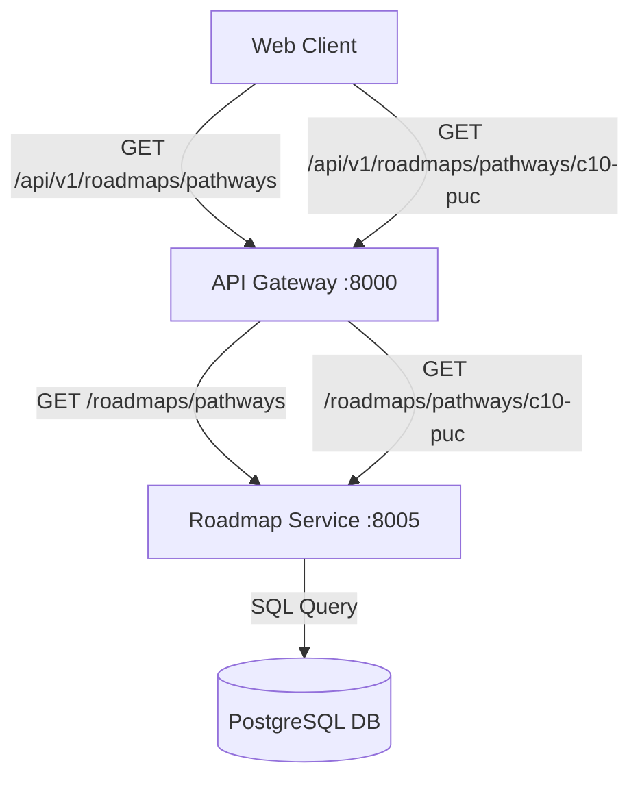

# Phase 4B Step 3B: API Gateway Integration for Roadmap Service Report

This report documents the API Gateway integration for the Roadmap Service in Phase 4B Step 3B.

---

## 1. Read-Only Audit Findings

- **Service URL Configuration**: Managed via Pydantic `BaseSettings` in `backend/api-gateway/app/core/config.py`.
- **Environment Variables**: Reads `ROADMAP_SERVICE_URL` from the environment with default fallback `http://localhost:8005`.
- **Docker Compose**: `ROADMAP_SERVICE_URL: "http://roadmap-service:8005"` was already present under `udaan-api-gateway` in `docker-compose.yml`.
- **Proxy Pattern**: Uses `httpx.AsyncClient` inside `forward_request()`, forwarding method, headers, params, and body to the internal service.
- **Error Handling**: Converts `httpx.RequestError` to `HTTPException(503)`. Extended to support public-safe custom error detail messages.

---

## 2. Gateway Architecture and Request Flow



---

## 3. Gateway Configuration Changes

- Added `ROADMAP_SERVICE_URL: str = "http://localhost:8005"` to `backend/api-gateway/app/core/config.py`.
- `docker-compose.yml` was left untouched as `ROADMAP_SERVICE_URL: "http://roadmap-service:8005"` was already present.

---

## 4. Files Created and Modified

- **Modified**:
  - `backend/api-gateway/app/core/config.py`: Added `ROADMAP_SERVICE_URL`.
  - `backend/api-gateway/app/api/routes/proxy.py`: Extended `forward_request()` with `error_detail` parameter; added explicit GET proxy endpoints for `/roadmaps/pathways` and `/roadmaps/pathways/{pathway_id}` under tag `Roadmaps`.
  - `backend/api-gateway/tests/test_gateway_proxy.py`: Added mock-based proxy test cases.
- **Created**:
  - `PHASE_4B_STEP_3B_API_GATEWAY_REPORT.md`

---

## 5. Public Routes Added

- `GET /api/v1/roadmaps/pathways`
- `GET /api/v1/roadmaps/pathways/{pathway_id}`

Non-GET methods (e.g. `POST`, `PUT`, `DELETE`) are blocked with HTTP `405 Method Not Allowed`. Unmapped sub-paths return HTTP `404 Not Found`.

---

## 6. Internal Roadmap Service Routes Targeted

- `/api/v1/roadmaps/pathways` → `http://roadmap-service:8005/roadmaps/pathways`
- `/api/v1/roadmaps/pathways/{pathway_id}` → `http://roadmap-service:8005/roadmaps/pathways/{pathway_id}`

---

## 7. Query Parameter Forwarding Behavior

Query parameters (`education_level`, `stream`) are extracted from `request.query_params` and passed to `httpx.AsyncClient().request(params=...)`.
- Parameters are passed without modification.
- URL encoding is preserved.
- If no query parameters are provided, none are forwarded.

---

## 8. Response / Status Preservation Behavior

- `HTTP 200 OK`: Preserved 1-to-1 with JSON content body and headers.
- `HTTP 404 Not Found`: Preserved 1-to-1 with response JSON (`{"detail": "Pathway 'does-not-exist' was not found."}`).

---

## 9. Upstream Failure Handling

When `roadmap-service` is unreachable or times out, `forward_request` catches `httpx.RequestError` and raises an `HTTPException`:
- Status code: `503 Service Unavailable`
- Detail: `{"detail": "Roadmap service is temporarily unavailable."}`
- Raw `httpx` error strings and stack trace details are hidden.

---

## 10. Gateway Test Coverage

`backend/api-gateway/tests/test_gateway_proxy.py` contains unit test coverage using `unittest.mock.patch`:
1. `test_gateway_health`: Gateway health check.
2. `test_proxy_roadmap_pathways_list`: `GET /api/v1/roadmaps/pathways` list proxying.
3. `test_proxy_roadmap_pathways_list_filtered`: Query parameter `education_level` forwarding.
4. `test_proxy_roadmap_pathways_list_multiple_filters`: Query parameters `education_level` & `stream` forwarding.
5. `test_proxy_roadmap_pathway_detail`: Pathway detail proxying.
6. `test_proxy_roadmap_pathway_detail_404`: Upstream 404 response preservation.
7. `test_proxy_roadmap_upstream_unavailable`: Upstream 503 public-safe error response.
8. `test_proxy_roadmap_disallowed_method`: Method safety check (HTTP 405).
9. `test_proxy_roadmap_unmapped_route`: Unmapped sub-path safety check (HTTP 404).

---

## 11. Full Backend Test Results

```text
============================= test session starts =============================
platform win32 -- Python 3.13.3, pytest-9.1.1, pluggy-1.6.0
rootdir: C:\Users\abulm\OneDrive\DCL\UdaanAI
plugins: anyio-4.11.0
collected 34 items

backend\admin-analytics-service\tests\test_admin_analytics_health.py .   [  2%]
backend\ai-career-service\tests\test_ai_career_health.py .               [  5%]
backend\api-gateway\tests\test_api_gateway_health.py .                   [  8%]
backend\api-gateway\tests\test_gateway_proxy.py .........                [ 35%]
backend\assessment-service\tests\test_assessment_health.py .             [ 38%]
backend\auth-service\tests\test_auth_api.py .                            [ 41%]
backend\auth-service\tests\test_auth_health.py .                         [ 44%]
backend\institution-service\tests\test_institution_health.py .           [ 47%]
backend\roadmap-service\tests\test_roadmap_api.py .......                [ 67%]
backend\roadmap-service\tests\test_roadmap_health.py .                   [ 70%]
backend\roadmap-service\tests\test_roadmap_models.py ..                  [ 76%]
backend\roadmap-service\tests\test_roadmap_seed_and_service.py .....     [ 91%]
backend\student-service\tests\test_student_api.py ..                     [ 97%]
backend\student-service\tests\test_student_health.py .                   [100%]

======================= 34 passed, 4 warnings in 18.87s =======================
```

---

## 12. Docker Verification

- Container `udaan-api-gateway` rebuilt and recreated cleanly.
- `docker compose ps` status: Up and Healthy.

---

## 13. Live Gateway API Results

HTTP requests evaluated against `http://localhost:8000`:
- `GET /api/v1/roadmaps/pathways` → `200 OK` (6 pathways returned)
- `GET /api/v1/roadmaps/pathways?education_level=Class%2010` → `200 OK` (3 pathways returned)
- `GET /api/v1/roadmaps/pathways?education_level=PUC%202&stream=Science` → `200 OK` (1 pathway returned: `puc-science-eng`)
- `GET /api/v1/roadmaps/pathways/c10-puc` → `200 OK` (detail returned with 3 options and 3 milestones)
- `GET /api/v1/roadmaps/pathways/does-not-exist` → `404 Not Found` (`{"detail": "Pathway 'does-not-exist' was not found."}`)
- `POST /api/v1/roadmaps/pathways` → `405 Method Not Allowed` (`{"detail": "Method Not Allowed"}`)

---

## 14. Swagger / OpenAPI Verification

- Accessing `http://localhost:8000/docs` displays `GET /api/v1/roadmaps/pathways` and `GET /api/v1/roadmaps/pathways/{pathway_id}` under the `Roadmaps` tag.
- Query parameters, operation IDs, and response descriptions are correctly rendered.

---

## 15. Git Scope Verification

Confirmed only `backend/api-gateway/` files were modified or created. `frontend/web/`, `backend/roadmap-service/`, and other microservices remained untouched.

---

## 16. Final Readiness Decision

Phase 4B Step 3B is complete and verified. The Roadmap API is available through the API Gateway and is ready for student frontend integration in Step 3C.
