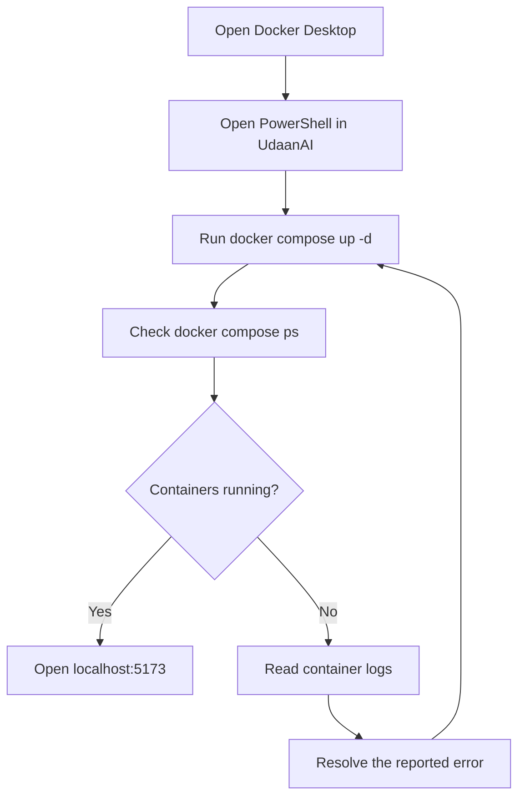
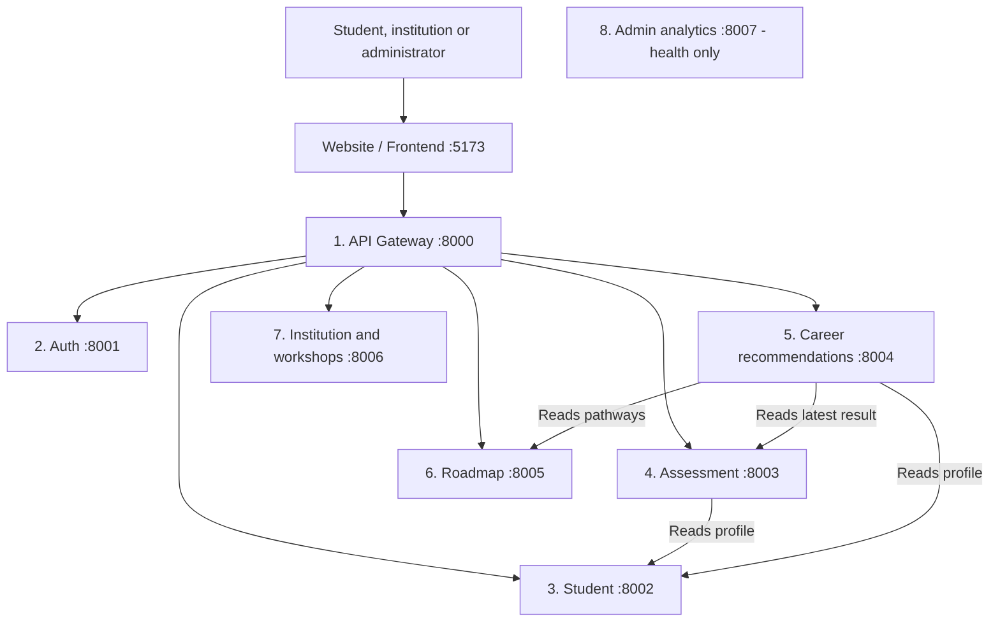
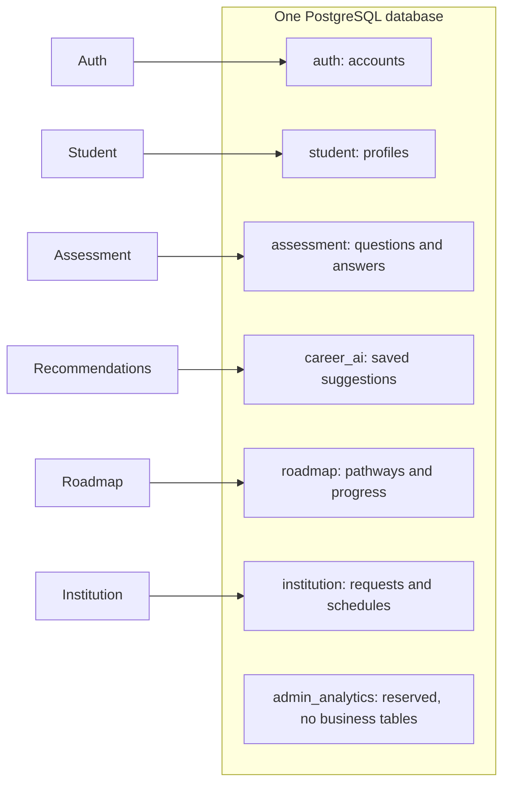
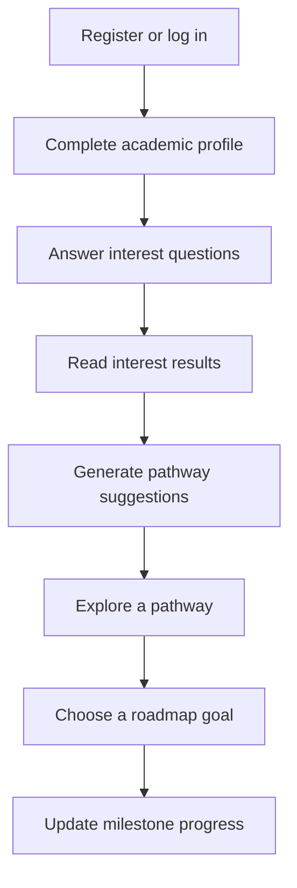
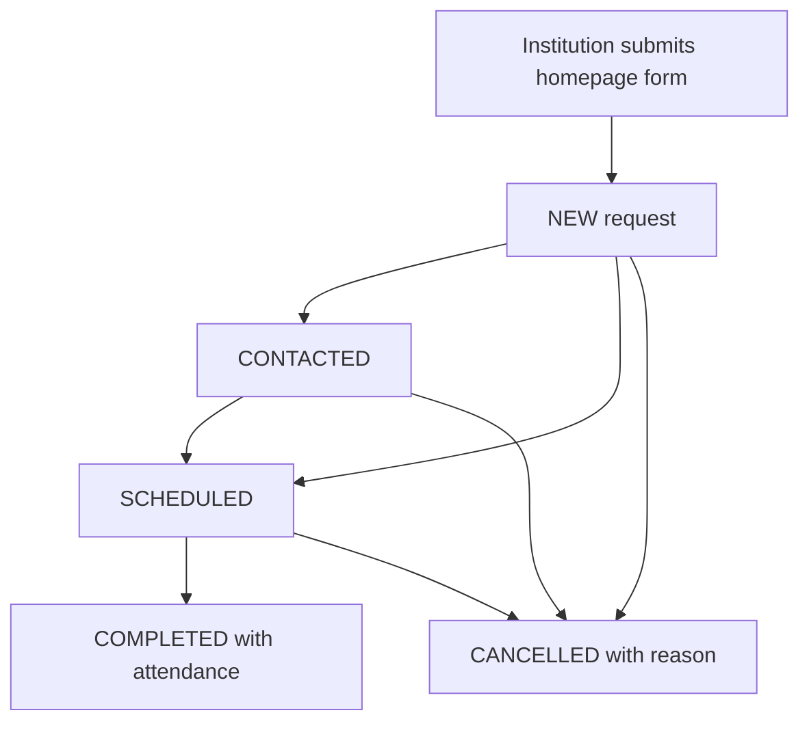
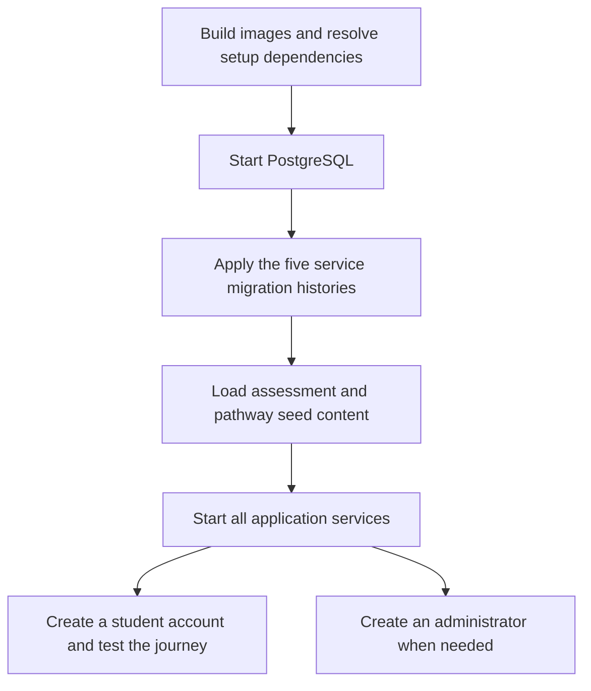

# Udaan AI — Start here

**A beginner-friendly guide to running and understanding your project.**

Updated: 9 September 2026.

Udaan AI helps students explore education and career options. Students can complete an interest questionnaire, see suggestions, choose a pathway and track their progress. Schools and colleges can also request workshops.

You do not need to understand all eight services before running the website. Start with **Section 1**.

## Find what you need

- [1. Run your existing project](#1-run-your-existing-project)
- [2. Stop, restart and update it](#2-stop-restart-and-update-it)
- [3. Understand the basic terms](#3-understand-the-basic-terms)
- [4. See how the services connect](#4-see-how-the-services-connect)
- [5. Follow the student and administrator journeys](#5-follow-the-student-and-administrator-journeys)
- [6. Understand the project folders](#6-understand-the-project-folders)
- [7. Set up on a new computer](#7-set-up-on-a-new-computer)
- [8. Solve common problems](#8-solve-common-problems)
- [9. Run the automated checks](#9-run-the-automated-checks)
- [10. Know what still needs work](#10-know-what-still-needs-work)

---

## 1. Run your existing project

**Use these steps for your current computer, where login and the database have already worked.** You do not need to create another admin account or reset your database.

All commands in this section run in **PowerShell**, from the main UdaanAI folder.

### Step 1 — Open Docker Desktop

Open Docker Desktop and wait until its engine is running.

Docker runs the website, backend services and database in separate containers. With this method, you do not need to start eight Python servers manually.

### Step 2 — Open PowerShell in the project folder

Run:

```powershell
Set-Location "C:\Users\abulm\OneDrive\DCL\UdaanAI"
```

**Expected result:** your terminal location ends in UdaanAI.

To check that you are in the correct folder:

```powershell
Test-Path .\docker-compose.yml
```

**Expected result:** True. If it says False, correct the folder before continuing.

### Step 3 — Check that Docker is available

```powershell
docker compose version
docker info
```

**Expected result:** version/server information without a connection error. If Docker cannot connect, return to Step 1.

### Step 4 — Check your settings file

```powershell
Test-Path .\.env
```

- **True:** keep the existing file. Continue to Step 5.
- **False, but this project already worked:** Compose can use fallback settings. Confirm which settings your existing database uses before creating or changing this file.
- **This is a completely new installation:** follow [Section 7](#7-set-up-on-a-new-computer).

The .env file stores settings such as the database connection and token-signing key. Changing a database password in this file does not automatically change the password inside an existing database.

### Step 5 — Start the project

For an ordinary restart:

```powershell
docker compose up -d
```

**What this means:** start the services in the background so you can keep using the terminal.

If Antigravity has changed backend code or dependencies, use the rebuild instructions in Section 2 instead.

### Step 6 — Check that the containers started

```powershell
docker compose ps
```

**Expected result:** ten running containers: eight backend services, one frontend and one database. Status wording may include Up or running. The database and gateway also have health checks; wait for those to become healthy.

If a service is missing, exited or restarting:

```powershell
docker compose ps -a
docker compose logs --tail 80
```

Read the final error lines before continuing. A running container does not, by itself, prove every feature works.

### Step 7 — Open the website

| What you want to open | Address |
| --- | --- |
| Public website | [localhost:5173](http://localhost:5173) |
| Student login | [Student login](http://localhost:5173/login) |
| Administrator login | [Admin login](http://localhost:5173/admin/login) |
| Gateway health check | [Gateway health](http://localhost:8000/health) |

Use the admin account you already recovered. A normal startup does not require another password reset.

### Step 8 — Check one real feature

Log in and refresh the dashboard. Confirm that it loads your information.

If the administrator sees **0 new requests**, that can be a valid empty queue. Submit a test request from the homepage using **Request a Workshop**, then refresh the admin dashboard. The full test flow is in Section 5.

**Daily startup flow**



In words: start Docker → start the project → check its status → open the website.

---

## 2. Stop, restart and update it

Run these commands from the **main project folder**.

### Stop work for the day

```powershell
docker compose stop
```

This stops the containers and keeps them and their saved database data.

### Start work again

```powershell
docker compose up -d
```

### Rebuild after code or dependency changes

```powershell
docker compose up -d --build
```

This rebuilds images as needed and starts the services. Rebuilding matters because several backend services run copies of code baked into their images.

**Rebuilding is not a database upgrade.** If a change includes migrations, inspect the database state and follow that change's migration plan separately.

### Stop and remove the containers

```powershell
docker compose down
```

This removes the containers/network but keeps the named PostgreSQL data volume. Use it only when you want to recreate containers later. Do not add the volume-removal option when you want to retain accounts and student data.

### Read one service's logs

Example for login problems:

```powershell
docker compose logs --tail 80 auth-service
```

Replace auth-service with the service name from the table below.

---

## 3. Understand the basic terms

| Term | Simple meaning | Example in Udaan AI |
| --- | --- | --- |
| Frontend | The pages and buttons a person sees | Student dashboard |
| Backend service | A running program responsible for one area | Auth checks login details |
| API | A way for programs to request work or data | The page asks for your profile |
| API gateway | The entry point that forwards requests | Sends profile requests to Student |
| Database | Persistent storage | Accounts, answers and saved progress |
| Schema | A named area inside the database | auth holds account tables |
| Table | A structured collection of records | users contains account records |
| Port | The number used to reach a running program | 5173 reaches the website |
| Docker image | A packaged program and its dependencies | The auth-service image |
| Container | A running instance of an image | udaan-auth-service |
| Volume | Storage that can survive container replacement | PostgreSQL's saved data |
| Token | A signed credential used after login | Identifies the current user |
| Migration | A versioned change to database structure | Adding a new column |
| Seed data | Initial content loaded into tables | Pathways and question banks |
| Test | A repeatable check of expected behavior | Students cannot use admin actions |

**One database, several schemas:** the project uses one PostgreSQL database. Its named areas are not seven separate database servers. Compose currently uses a shared database account for the services.

---

## 4. See how the services connect

### The overall picture

Solid arrows below show browser requests and service-to-service calls. Responses travel back to the caller.



The eight backend services are the gateway, six business services and the health-only analytics service. The separate Admin analytics box is intentionally unconnected: no business API connects it to the current dashboard.

### Where the data is stored



The gateway does not store student data. Business services read/write their own tables. Some also request information from other services, as shown in the first diagram.

### The eight services at a glance

Click a service name for its beginner guide.

| Service | Main question it answers | Port |
| --- | --- | --- |
| [API gateway](docs/services/api-gateway.md) | Which service should handle this request? | 8000 |
| [Authentication](docs/services/auth-service.md) | Who is logging in? | 8001 |
| [Student profiles](docs/services/student-service.md) | What is this student's academic context? | 8002 |
| [Assessments](docs/services/assessment-service.md) | Which interests do their answers indicate? | 8003 |
| [Career recommendations](docs/services/ai-career-service.md) | Which available pathways do our rules suggest exploring? | 8004 |
| [Roadmaps](docs/services/roadmap-service.md) | What can the student explore and track next? | 8005 |
| [Institutions and workshops](docs/services/institution-service.md) | Which workshops were requested, scheduled or completed? | 8006 |
| [Admin analytics](docs/services/admin-analytics-service.md) | Currently only: is this service running? | 8007 |

**Two distinctions to remember**

- The working admin workshop dashboard uses **Institution**, not Admin analytics.
- Career recommendations currently use **programmed rules**, not a language model. An AI explanation feature is future work.

Flowcharts use Mermaid. View this file in a Markdown preview that supports Mermaid to see diagrams; the nearby explanations remain readable without it.

---

## 5. Follow the student and administrator journeys

### Student journey



1. **Auth** creates or checks the account.
2. **Student** saves the academic profile.
3. **Assessment** chooses suitable questions and records answers.
4. **Recommendations** combines profile, results and pathway information.
5. **Roadmap** stores the selected goal and progress.

This is the suggested journey, not a claim that every screen must always be visited in that order.

### Administrator workshop journey



**How to test when no requests are available**

1. Keep the admin page open.
2. Open the public homepage in another tab.
3. Click **Request a Workshop**.
4. Enter clearly labelled test institution details and submit.
5. Return to admin and click **Refresh Data**.
6. Open the new request, mark it Contacted if appropriate, and schedule it.
7. Complete that test workshop and enter attendance. Refresh to check persistence.
8. Create a **second** test request for checking cancellation.

COMPLETED and CANCELLED are final states in the current implementation. A cancelled request cannot be scheduled again. Marking Contacted records status; it does not send a message or make a call.

The administrator console is focused strictly on workshop operations. Dedicated pathway preview screens are removed from the admin console; administrators inspect education pathways directly on the public homepage map with inline read-only details. Any existing links or bookmarks to `/admin/pathways` automatically redirect to the public homepage map view (`/?pathway_id=...#pathways`).

---

## 6. Understand the project folders

| Location | What it contains | When you open it |
| --- | --- | --- |
| README.md | This guide | Starting or understanding the project |
| docs/services/ | Eight service guides | Understanding one backend area |
| frontend/web/src/pages/ | Full screens | Changing a page |
| frontend/web/src/components/ | Reusable interface pieces | Changing a button, form or layout |
| frontend/web/src/api/client.js | Browser-to-backend calls | Investigating a failed page request |
| frontend/web/src/styles/global.css | Shared styles and design variables | Changing the visual style |
| backend/&lt;service&gt;/app/ | Backend implementation | Changing service behavior |
| backend/&lt;service&gt;/tests/ | Backend checks | Checking a change |
| backend/&lt;service&gt;/alembic/ | Database changes, where present | Updating database structure |
| infrastructure/postgres/ | Initial database schema SQL | Understanding first database creation |
| docker-compose.yml | Container connections and settings | Running the full stack |
| .env.example | Settings template | Preparing a fresh local setup |

Inside a backend app folder:

```text
main.py       Starts the application and registers its routes
api/routes/   Receives API requests
schemas/      Validates request and response data
services/     Applies business rules
models/       Describes database tables
db/           Connects to the database; may contain seed content
core/         Settings and security helpers
__init__.py   Marks a Python package; often intentionally empty
```

Not every service needs every folder. The gateway and health-only analytics service have fewer layers.

Keep source tests, migrations, seeds, dependency lists and the frontend lockfile. Installed dependencies and caches may contain many files, but they are generated and ignored by Git. The maintained documentation remains **one README and eight service guides**.

---

## 7. Set up on a new computer

**This is different from starting your existing working installation.** Do not apply fresh-database steps to a database containing accounts or student progress.

The daily-run steps in Section 1 are ready to use. A complete clean installation still has a known dependency gap and needs separate verification.

### Step 1 — Prepare the folder and Docker

Install/start Docker Desktop and obtain this repository. Open PowerShell in the folder containing docker-compose.yml. The Docker images supply Python and Node; host installations are needed only for running development tools outside Docker.

### Step 2 — Create local settings if missing

```powershell
if (-not (Test-Path .\.env)) {
    Copy-Item .\.env.example .\.env
}
```

Open .env and review the settings. For a fresh database, choose local database credentials and a shared JWT signing key before its first initialization. Keep settings private.

Some template values, including backend port variables and token lifetime variables, are not passed through by the current Compose file. Editing them alone will not change those container settings.

### Step 3 — Build the images

```powershell
docker compose build
```

**Expected result:** the builds finish without errors. Building packages code; it does not create the application tables.

### Step 4 — Check the known migration dependency gap

The recommendation service has Alembic migration files, but its requirements.txt does not declare Alembic, the tool that applies them. A fresh image therefore cannot be assumed to run these migrations.

Check the image without starting the database:

```powershell
docker compose run --rm --no-deps ai-career-service python -m alembic --version
```

If it reports **No module named alembic**, the dependency must be added to that service and its image rebuilt before continuing. This documentation update does not change dependency files. Ask your implementation tool to resolve the gap and verify a clean installation.

### Step 5 — Prepare database structure and content

The intended order for a genuinely fresh database is:



There are migration histories for Student, Assessment, Recommendations, Roadmap and Institution. Auth creates its account table at startup. Some other services also attempt table creation at startup, so migration order matters.

**Why this needs care:** creating tables through startup code before running their initial migration can cause “table already exists” errors. On an existing database, inspect both tables and migration history, take a backup and use a reviewed upgrade plan. Do not delete the database or blindly mark migrations as complete to bypass errors.

The [service guides](#4-see-how-the-services-connect) explain each service's data setup. Fresh installation and PostgreSQL backup/restore remain unverified as a complete workflow.

---

## 8. Solve common problems

| What you see | What it may mean | First action |
| --- | --- | --- |
| Docker cannot connect | Docker engine is stopped | Open Docker Desktop and retry docker info |
| No Compose file found | Wrong terminal folder | Return to the UdaanAI root folder |
| Port already in use | Another process/container uses that port | Inspect docker compose ps and docker ps |
| Website does not open | Frontend did not start | Read frontend logs |
| Login fails | Credentials, auth service or database issue | Read auth-service logs; use the auth guide if reset is needed |
| Admin shows zero requests | No NEW submissions are available | Submit a test request using the homepage form |
| A request returns 503 | Gateway cannot reach a service | Read gateway and affected service logs |
| Relation/column does not exist | Database structure is missing/outdated | Inspect migration state; do not reset the volume |
| Page changes but backend behavior is old | A backend image still contains old code | Rebuild with docker compose up -d --build |
| Health is OK but a feature fails | Process runs, but its database/dependency may fail | Check the actual feature and corresponding logs |

For example, to inspect workshop failures:

```powershell
docker compose logs --tail 80 institution-service
```

For read-only migration inspection of a running roadmap service:

```powershell
docker compose exec roadmap-service python -m alembic current
docker compose exec roadmap-service python -m alembic heads
```

“Current” is the recorded database version; “heads” is the latest revision in the code. Comparing them is only one part of checking an existing database.

---

## 9. Run the automated checks

Tests check behavior repeatedly. A passing test suite does not prove educational accuracy or a complete production deployment.

### Check the frontend using Docker

Run from the project root while the frontend container is running:

```powershell
docker compose exec frontend npm test
docker compose exec frontend npm run build
```

The first command checks frontend behavior. The second checks whether the website can be built.

### Check one backend service using Docker

Example:

```powershell
docker compose exec auth-service python -m pytest tests -q
```

Each service guide gives its own command. Containers need current code and dependencies; rebuild when necessary. Test results in an image can differ from host results if dependency versions differ.

### Run checks on the host instead — optional

For frontend checks, install a compatible Node version, then:

```powershell
Set-Location "C:\Users\abulm\OneDrive\DCL\UdaanAI\frontend\web"
npm ci
npm test
npm run build
```

For backend checks, install the relevant service's requirements into your Python development environment. Run each service's tests separately because all services use a package named app. Do not combine all service tests into one Python test process.

The frontend declares a lint command, but its ESLint dependency/configuration is not complete. It is not currently a working check.

### Last recorded checks

During the earlier file cleanup on 9 September 2026:

- All **95 backend tests** passed on the host before cleanup.
- The **17 tests** for the two changed backend services passed again afterward.
- All **37 frontend tests** passed after cleanup.
- The frontend build passed with identical application asset hashes before and after cleanup.

These are historical results, not a claim that tests were re-run for this wording update. Most business tests use temporary SQLite databases or mocked service responses. They do not replace live PostgreSQL and browser checks.

---

## 10. Know what still needs work

| Area | Current position |
| --- | --- |
| Admin access | Successful browser login confirmed by the owner |
| Full live journeys | Student and workshop flows still need recorded end-to-end checks |
| Fresh installation | Recommendation migration dependency gap and full setup verification remain |
| Database reliability | Migration and backup/restore checks remain |
| Security and deployment | Session revocation, production secrets, rate limiting, TLS and monitoring remain |
| Legal & Support destinations | Policy pages (Privacy, Terms) and official support channel remain outstanding product work (nonfunctional placeholder anchors removed from local footer) |
| Educational content | Sources, eligibility claims and pathway relationships need review |
| Recommendations | Rules exist; stale results and some strong wording need improvement |
| Kannada and accessibility | Full translation and usability validation remain |
| First AI feature | Grounded AI explanations are not implemented |
| Admin analytics | Health endpoint only |

The current Compose setup is for local development. It exposes service ports and runs Vite's development server.

For deeper explanations, choose one of the eight service guides above. Each starts with its purpose and an example, followed by a flowchart, checks and a developer reference.
