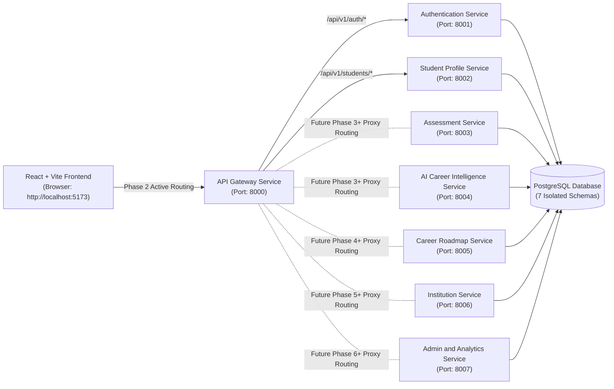

# Technical Architecture — Udaan AI

## Overview

Udaan AI is architected as an 8-microservice platform designed for scale, clean boundary separation, and domain ownership.

> [!NOTE]
> In Phase 2, `API Gateway` routes `/api/v1/auth/*` to `auth-service` and `/api/v1/students/*` to `student-service`. The remaining 5 microservices remain Phase 1 health skeletons.

---

## Data Ownership & Database Boundaries

Each backend microservice logically owns its own schema within PostgreSQL:

| Microservice | PostgreSQL Schema | Domain Owned | Phase Status |
| ------------ | ----------------- | ------------ | ------------ |
| `auth-service` | `auth` | User accounts, credentials, roles, JWT token metadata | **Phase 2 Active** |
| `student-service` | `student` | Academic profiles, Class, Board, District, language | **Phase 2 Active** |
| `assessment-service` | `assessment` | Assessment questions, responses, scoring outputs | Phase 1 Skeleton |
| `ai-career-service` | `career_ai` | Recommendation logs, prompt context, compatibility scores | Phase 1 Skeleton |
| `roadmap-service` | `roadmap` | Career routes, milestones, goals, progress tracking | Phase 1 Skeleton |
| `institution-service` | `institution` | Public institution pages, workshop directory, registrations | Phase 1 Skeleton |
| `admin-analytics-service` | `admin_analytics` | Platform metrics, activity logs, administrative data | Phase 1 Skeleton |
| `api-gateway` | None | Pure routing & cross-cutting concern entrypoint | **Active Proxy** |

### Rules:
1. No service directly queries another service's database schema.
2. Cross-service data requests are conducted via synchronous REST APIs or JWT claims.
3. Database connection credentials are provided strictly via environment variables.

---

## Networking Boundaries (Browser vs Docker)

1. **Browser Networking**: The React application runs in the user's web browser and communicates with the API Gateway at `http://localhost:8000`. It MUST NOT attempt to use Docker internal service names (such as `http://api-gateway:8000`) because Docker internal DNS is not resolvable outside container networks.
2. **Docker Internal Networking**: Backend containers within the Docker network communicate with each other using Docker container names (e.g., `http://auth-service:8001`, `http://postgres:5432`).
