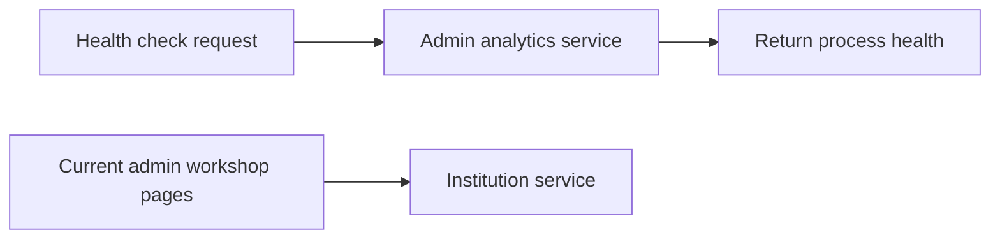

# Admin analytics — Reserved for future reporting

[← Back to the project guide](../../README.md) · Port **8007** · Updated **9 September 2026**

## 1. What is this service for?

This service currently only reports whether its process is running. It is reserved for future analytics work.

**Example:** Opening its health address returns a small health response. It does not show counts, student insights or reports from the database.

## 2. What happens inside it?



The two paths are separate. The existing admin dashboard gets its workshop information from Institution; it does not use this analytics service.

## 3. What does it do today?

- Starts a FastAPI application on port 8007.
- Provides a health response and the framework's API documentation pages.

**What it does not do:** It has no business endpoints, analytics calculations, report-generation jobs or application tables. Its name describes an intended future responsibility.

## 4. Which parts does it connect to?

| Connected part | Why they connect |
| --- | --- |
| Direct health checks | Can check whether the process responds |
| Gateway | No business route is registered |
| Workshop admin pages | Use Institution instead |
| Database | The admin_analytics schema is reserved, but there are no business tables |

## 5. What information does it save?

**No business data is currently stored by this service.** Database configuration exists for future use. There is no migration history.

## 6. How do I run and check it?

### Step 1 — Start the project

Follow [the README startup steps](../../README.md#1-run-your-existing-project). Run the commands below from the main **UdaanAI** folder, with Docker Desktop and the stack running.

### Step 2 — Check this container

```powershell
docker compose ps admin-analytics-service
```

**Expected result:** the container is running. If it is exited or restarting, read its logs:

```powershell
docker compose logs --tail 80 admin-analytics-service
```

### Step 3 — Open its health page

Open [http://localhost:8007/health](http://localhost:8007/health).

**Expected result:** a small response identifying the service and its health status. This proves the process answers; it does not prove all business features or database connections work.

### Step 4 — Run its automated checks when needed

```powershell
docker compose exec admin-analytics-service python -m pytest tests -q
```

**Expected result:** a passing test summary. Run checks after relevant changes; you do not need to run them every time you open the website. Rebuild the image first if its code/dependencies changed.

The test verifies only the health endpoint. Passing it does not mean analytics or administrator authorization is implemented.

For a configured host Python environment instead of Docker, run this from the project root:

```powershell
python -m pytest backend/admin-analytics-service/tests -q
```

Install this service's requirements in that host environment first. Host and image dependency versions can differ.

## 7. What still needs attention?

There are no analytics features to verify yet. Any future reports need a defined purpose, appropriate access controls and careful handling of student information.

## 8. Developer reference — read when you need more detail

You can use the website without memorizing this section.

### Main API operations

An API operation is an address the website or another service calls. **GET** usually reads data, **POST** submits an action, and **PUT/PATCH** changes data. These entries describe the implemented API; they are not all buttons shown on screen.

| Method | Path | Purpose |
| --- | --- | --- |
| GET | /health | Check the process |

For interactive API details, open [this service's API documentation](http://localhost:8007/docs).

### Important files

All paths below are inside [backend/admin-analytics-service](../../backend/admin-analytics-service).

| File | Plain-language purpose |
| --- | --- |
| [app/main.py](../../backend/admin-analytics-service/app/main.py) | Starts the health-only app |
| [app/api/routes/health.py](../../backend/admin-analytics-service/app/api/routes/health.py) | Returns the health response |
| [app/core/config.py](../../backend/admin-analytics-service/app/core/config.py) | Defines service settings |
| [tests/test_admin_analytics_health.py](../../backend/admin-analytics-service/tests/test_admin_analytics_health.py) | Checks the health response |

The service remains in Compose to preserve the current eight-service structure. Its unused database and business-layer scaffolding was removed during cleanup.

`app/main.py` registers the health router. The framework also exposes `/docs` and `/redoc`. Compose supplies an `ADMIN_ANALYTICS_SERVICE_URL` to the gateway, but the gateway does not use that value.

Before implementing analytics, decide which useful question the product needs answered. For example, a future aggregate report might summarize activity without exposing individual students. That is a proposed direction, not a current feature.

Removing or merging the service changes the architecture and is a separate decision.

---

[Return to the startup guide](../../README.md#1-run-your-existing-project) · [See all service connections](../../README.md#4-see-how-the-services-connect)
