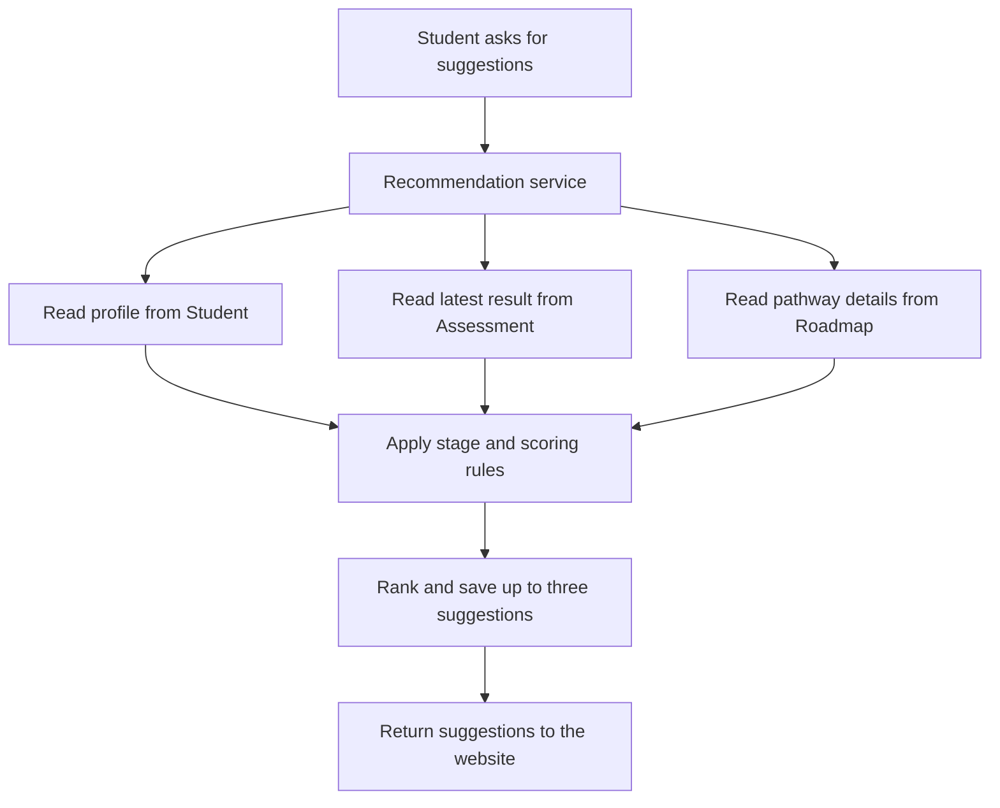

# Career recommendations — Suggestions from rules

[← Back to the project guide](../../README.md) · Port **8004** · Updated **9 September 2026**

## 1. What is this service for?

This service suggests pathways to explore using the student's profile, assessment results and the available pathway catalog.

**Example:** A student finishes an assessment and requests suggestions. The service reads their academic stage, finds eligible candidate pathways under its programmed rules, scores them and saves up to three suggestions.

## 2. What happens inside it?



Three sources feed one recommendation calculation. These arrows show data inputs, not a claim that the code performs the three reads in parallel.

## 3. What does it do today?

- Reads the current profile and latest assessment result.
- Selects candidate pathway groups for Foundation, PUC streams, Diploma or ITI.
- Applies programmed scoring and filtering rules.
- Saves suggestions, ranks, explanation strings and their source identifiers.
- Returns the most recently saved recommendation record.

**What it does not do:** There is no language-model integration here yet. The name ai-career-service does not mean ChatGPT or another AI provider generates the current suggestions.

## 4. Which parts does it connect to?

| Connected part | Why they connect |
| --- | --- |
| Website through gateway | Requests or reads suggestions |
| Student service | Supplies academic context |
| Assessment service | Supplies interest result |
| Roadmap service | Supplies pathway metadata |
| Database: career_ai area | Stores recommendation history |

## 5. What information does it save?

**career_recommendation_results** stores a generated result and its source information. **career_recommendation_items** stores the suggestions within that result, including pathway, score, rank and predefined reasons.

## 6. How do I run and check it?

### Step 1 — Start the project

Follow [the README startup steps](../../README.md#1-run-your-existing-project). Run the commands below from the main **UdaanAI** folder, with Docker Desktop and the stack running.

### Step 2 — Check this container

```powershell
docker compose ps ai-career-service
```

**Expected result:** the container is running. If it is exited or restarting, read its logs:

```powershell
docker compose logs --tail 80 ai-career-service
```

### Step 3 — Open its health page

Open [http://localhost:8004/health](http://localhost:8004/health).

**Expected result:** a small response identifying the service and its health status. This proves the process answers; it does not prove all business features or database connections work.

### Step 4 — Run its automated checks when needed

```powershell
docker compose exec ai-career-service python -m pytest tests -q
```

**Expected result:** a passing test summary. Run checks after relevant changes; you do not need to run them every time you open the website. Rebuild the image first if its code/dependencies changed.

Tests use mocked upstream replies to check missing assessments, stage constraints, thresholds and token validation. A live check should complete a real assessment, generate suggestions and confirm they remain after refreshing.

For a configured host Python environment instead of Docker, run this from the project root:

```powershell
python -m pytest backend/ai-career-service/tests -q
```

Install this service's requirements in that host environment first. Host and image dependency versions can differ.

## 7. What still needs attention?

Some predefined reasons contain strong aptitude or educational-route claims that need review. Stale recommendations and pathway relationships need improvement. A future grounded AI explanation feature must be built and evaluated separately.

## 8. Developer reference — read when you need more detail

You can use the website without memorizing this section.

### Main API operations

The table shows direct service paths. For browser calls through the gateway, put `/api/v1` before the business path. For example, `/auth/login` becomes `/api/v1/auth/login`. Health checks use the service port directly.

An API operation is an address the website or another service calls. **GET** usually reads data, **POST** submits an action, and **PUT/PATCH** changes data. These entries describe the implemented API; they are not all buttons shown on screen.

| Method | Direct path | Purpose |
| --- | --- | --- |
| POST | /career-intelligence/recommendations/generate | Generate and save suggestions |
| GET | /career-intelligence/recommendations/me | Latest saved suggestions, or null |
| GET | /health | Process health |

For interactive API details, open [this service's API documentation](http://localhost:8004/docs).

### Important files

All paths below are inside [backend/ai-career-service](../../backend/ai-career-service).

| File | Plain-language purpose |
| --- | --- |
| [app/api/routes/recommendation.py](../../backend/ai-career-service/app/api/routes/recommendation.py) | Receives recommendation requests |
| [app/services/recommendation_service.py](../../backend/ai-career-service/app/services/recommendation_service.py) | Reads inputs and applies scoring rules |
| [app/models/recommendation.py](../../backend/ai-career-service/app/models/recommendation.py) | Describes results and suggestion tables |
| [app/schemas/recommendation.py](../../backend/ai-career-service/app/schemas/recommendation.py) | Describes API responses |
| [requirements.txt](../../backend/ai-career-service/requirements.txt) | Lists installed dependencies; migration tool is currently missing |

### How the current scoring works

1. Choose the student's stage-specific candidate group.
2. Match applicable assessment dimensions to candidate pathways.
3. Calculate scores and round to multiples of five.
4. Exclude scores below 25.
5. Sort by score, then pathway title, and keep up to three.

| Label | Current score range |
| --- | --- |
| High | 70 or above |
| Good | 50 to below 70 |
| Explore | 25 to below 50 |

These labels describe the rule output, not a calibrated probability of career success.

Configuration includes database/JWT settings and `STUDENT_SERVICE_URL`, `ASSESSMENT_SERVICE_URL`, `ROADMAP_SERVICE_URL`. Requests to those services forward the user's access token. A profile and completed assessment are prerequisites.

### Fresh-installation gap

This service has an initial Alembic migration for its tables, but its `requirements.txt` does **not** declare Alembic. A fresh image may report `No module named alembic`. Resolve the dependency and verify database setup before claiming a working clean installation.

`app/main.py` does not create these tables at startup. Reading the latest saved result also does not regenerate it automatically after a profile change.

---

[Return to the startup guide](../../README.md#1-run-your-existing-project) · [See all service connections](../../README.md#4-see-how-the-services-connect)
