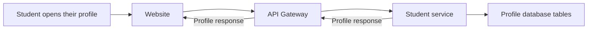

# API Gateway — The front door to the backend

[← Back to the project guide](../../README.md) · Port **8000** · Updated **9 September 2026**

## 1. What is this service for?

The gateway receives requests from the website and forwards each one to the correct backend service. This gives the frontend one main backend address to use.

**Example:** When a student opens their profile, the website sends a profile request to the gateway. The gateway forwards it to the Student service and sends the reply back to the page.

## 2. What happens inside it?



The gateway handles delivery. The Student service decides which profile the user may access and retrieves the data.

## 3. What does it do today?

- Receives browser API requests on port 8000.
- Routes requests to Auth, Student, Assessment, Recommendations, Roadmap or Institution.
- Passes the request body, query details and login credential onward.
- Returns the downstream reply, including errors such as unauthorized access.
- Allows requests from configured website origins, such as localhost:5173.

**What it does not do:** It does not own student records, calculate recommendations or perform the business services' token/role checks. It also does not currently forward requests to Admin analytics.

## 4. Which parts does it connect to?

| Connected part | Why they connect |
| --- | --- |
| Website | Sends all normal browser API calls here |
| Six business services | Handle the forwarded work |
| Database | No direct database connection |
| Admin analytics | No business connection is configured |

## 5. What information does it save?

**Stores no business data.** There are no gateway-owned tables or migrations.

## 6. How do I run and check it?

### Step 1 — Start the project

Follow [the README startup steps](../../README.md#1-run-your-existing-project). Run the commands below from the main **UdaanAI** folder, with Docker Desktop and the stack running.

### Step 2 — Check this container

```powershell
docker compose ps api-gateway
```

**Expected result:** the container is running. If it is exited or restarting, read its logs:

```powershell
docker compose logs --tail 80 api-gateway
```

### Step 3 — Open its health page

Open [http://localhost:8000/health](http://localhost:8000/health).

**Expected result:** a small response identifying the service and its health status. This proves the process answers; it does not prove all business features or database connections work.

### Step 4 — Run its automated checks when needed

```powershell
docker compose exec api-gateway python -m pytest tests -q
```

**Expected result:** a passing test summary. Run checks after relevant changes; you do not need to run them every time you open the website. Rebuild the image first if its code/dependencies changed.

Tests check forwarding, query filters, unavailable upstreams and preservation of authorization errors. They use mocked upstream services, so a real student/profile request is still needed to verify the live connection.

For a configured host Python environment instead of Docker, run this from the project root:

```powershell
python -m pytest backend/api-gateway/tests -q
```

Install this service's requirements in that host environment first. Host and image dependency versions can differ.

## 7. What still needs attention?

A successful health check only proves the gateway process responds. It does not prove all downstream services are ready. Request rate limiting and production proxy hardening remain future work.

## 8. Developer reference — read when you need more detail

You can use the website without memorizing this section.

### Main API operations

An API operation is an address the website or another service calls. **GET** usually reads data, **POST** submits an action, and **PUT/PATCH** changes data. These entries describe the implemented API; they are not all buttons shown on screen.

| Gateway prefix | Target service | Direct prefix |
| --- | --- | --- |
| /api/v1/auth | auth-service:8001 | /auth |
| /api/v1/students | student-service:8002 | /students |
| /api/v1/assessments | assessment-service:8003 | /assessments |
| /api/v1/career-intelligence | ai-career-service:8004 | /career-intelligence |
| /api/v1/roadmaps | roadmap-service:8005 | /roadmaps |
| /api/v1/workshops | institution-service:8006 | /workshops |

For interactive API details, open [this service's API documentation](http://localhost:8000/docs).

### Important files

All paths below are inside [backend/api-gateway](../../backend/api-gateway).

| File | Plain-language purpose |
| --- | --- |
| [app/main.py](../../backend/api-gateway/app/main.py) | Starts the gateway and configures browser-origin rules |
| [app/api/routes/proxy.py](../../backend/api-gateway/app/api/routes/proxy.py) | Chooses the destination and forwards requests |
| [app/core/config.py](../../backend/api-gateway/app/core/config.py) | Reads gateway settings |
| [Dockerfile](../../backend/api-gateway/Dockerfile) | Packages the gateway and its health-check tool |

The frontend sends requests under `/api/v1`. The gateway removes that part when forwarding: for example, `/api/v1/students/profile/me` becomes `/students/profile/me`.

Only methods registered in the route file are supported. A prefix in the table does not mean every possible operation exists.

Configuration:
- `ALLOWED_ORIGINS`: websites allowed to call the gateway from a browser.
- The six `*_SERVICE_URL` values: where to find each business service.
- Outside Docker, set `INSTITUTION_SERVICE_URL=http://localhost:8006`; its fallback uses a Docker hostname.

Forwarding uses a ten-second timeout and strips the incoming Host header. Connection failures return 503. Downstream responses such as 401 and 403 are preserved. The optional bearer dependency does not authenticate the user.

Compose supplies an `ADMIN_ANALYTICS_SERVICE_URL`, but the gateway does not use it. Its API documentation describes proxy routes, not all business request fields.

---

[Return to the startup guide](../../README.md#1-run-your-existing-project) · [See all service connections](../../README.md#4-see-how-the-services-connect)
