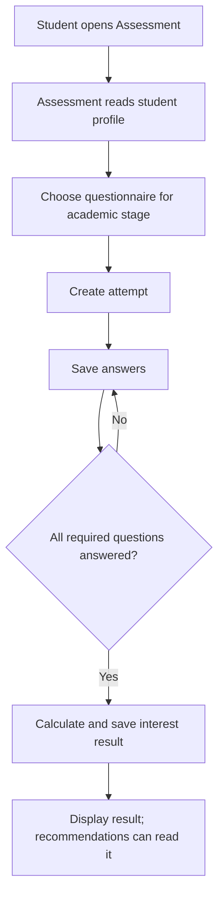

# Assessments — Interest questions and results

[← Back to the project guide](../../README.md) · Port **8003** · Updated **9 September 2026**

## 1. What is this service for?

The Assessment service selects questions for the student's academic stage, saves their answers and calculates interest scores.

**Example:** After completing a profile, a student opens Assessment. The service reads the profile, chooses an appropriate questionnaire and creates an attempt. Once all required answers are provided, it calculates and saves the result.

## 2. What happens inside it?



An attempt means one instance of a student taking a questionnaire. The saved result belongs to that student and attempt.

## 3. What does it do today?

- Chooses questions based on profile stage.
- Creates attempts and saves answers.
- Checks that a student owns the attempt they are changing.
- Calculates rule-based scores and stores results.
- Tracks assessment/scoring versions and reports the latest result's status.

**What it does not do:** It does not measure scientifically validated aptitude or guarantee a suitable career. Its scores are exploratory interest signals, not admission decisions.

## 4. Which parts does it connect to?

| Connected part | Why they connect |
| --- | --- |
| Assessment page through gateway | Starts attempts, submits answers and displays results |
| Student service | Provides academic context |
| Recommendation service | Reads the latest assessment result |
| Database: assessment area | Stores catalog, attempts, answers and results |

## 5. What information does it save?

The database separates question content from student activity. **assessments**, **assessment_questions** and **assessment_question_options** store the catalog. **assessment_attempts**, **assessment_answers** and **assessment_results** store what students did and their calculated results.

## 6. How do I run and check it?

### Step 1 — Start the project

Follow [the README startup steps](../../README.md#1-run-your-existing-project). Run the commands below from the main **UdaanAI** folder, with Docker Desktop and the stack running.

### Step 2 — Check this container

```powershell
docker compose ps assessment-service
```

**Expected result:** the container is running. If it is exited or restarting, read its logs:

```powershell
docker compose logs --tail 80 assessment-service
```

### Step 3 — Open its health page

Open [http://localhost:8003/health](http://localhost:8003/health).

**Expected result:** a small response identifying the service and its health status. This proves the process answers; it does not prove all business features or database connections work.

### Step 4 — Run its automated checks when needed

```powershell
docker compose exec assessment-service python -m pytest tests -q
```

**Expected result:** a passing test summary. Run checks after relevant changes; you do not need to run them every time you open the website. Rebuild the image first if its code/dependencies changed.

Tests check question selection for stages, incomplete answers/profiles, ownership, scoring and token rejection. Frontend tests also check displayed scores. A live check should finish an assessment, refresh and confirm its result persists.

For a configured host Python environment instead of Docker, run this from the project root:

```powershell
python -m pytest backend/assessment-service/tests -q
```

Install this service's requirements in that host environment first. Host and image dependency versions can differ.

## 7. What still needs attention?

Question wording and educational implications still need review. Interest scores should not be described as career guarantees. Profile/content changes and the resulting recommendation freshness need coordinated checks. PostgreSQL upgrades remain separately unverified.

## 8. Developer reference — read when you need more detail

You can use the website without memorizing this section.

### Main API operations

The table shows direct service paths. For browser calls through the gateway, put `/api/v1` before the business path. For example, `/auth/login` becomes `/api/v1/auth/login`. Health checks use the service port directly.

An API operation is an address the website or another service calls. **GET** usually reads data, **POST** submits an action, and **PUT/PATCH** changes data. These entries describe the implemented API; they are not all buttons shown on screen.

| Method | Direct path | Purpose |
| --- | --- | --- |
| GET | /assessments | Active catalog |
| GET | /assessments/my-assessment | Resolve using profile |
| GET | /assessments/my-latest-result | Latest personal result with status |
| GET | /assessments/{assessment_id} | Detail |
| POST | /assessments/attempts | Start automatically selected assessment |
| POST | /assessments/{assessment_id}/attempts | Start specified compatible assessment |
| POST | /assessments/attempts/{attempt_id}/answers | Submit answer |
| POST | /assessments/attempts/{attempt_id}/complete | Complete and score |
| GET | /assessments/attempts/{attempt_id} | Attempt detail |
| GET | /assessments/attempts/{attempt_id}/result | Result |
| GET | /health | Process health |

For interactive API details, open [this service's API documentation](http://localhost:8003/docs).

### Important files

All paths below are inside [backend/assessment-service](../../backend/assessment-service).

| File | Plain-language purpose |
| --- | --- |
| [app/api/routes/assessment.py](../../backend/assessment-service/app/api/routes/assessment.py) | Receives assessment requests |
| [app/services/assessment_service.py](../../backend/assessment-service/app/services/assessment_service.py) | Selects questions, checks ownership and calculates results |
| [app/services/student_client.py](../../backend/assessment-service/app/services/student_client.py) | Reads the student profile |
| [app/db/seed_assessments.py](../../backend/assessment-service/app/db/seed_assessments.py) | Loads the question content |
| [app/db/v2_assessments_data.py](../../backend/assessment-service/app/db/v2_assessments_data.py) | Contains the stage-specific question data |

### Content versus test data

`app/db/seed_assessments.py` and `v2_assessments_data.py` are real application content sources. They are not disposable test files.

A seed operation loads that content into database tables. It can change stored content, so it is not part of an ordinary daily restart.

The explicit command, used only after database preparation and review, is:

```powershell
docker compose exec assessment-service python -m app.db.seed_runner
```

There are two Alembic revisions: initial assessment tables and assessment/result version fields. Startup attempts table/schema creation, but that does not safely replace versioned upgrades for an existing database.

Configuration includes database/JWT settings and `STUDENT_SERVICE_URL`. For host execution outside Docker, use `http://localhost:8002` instead of the Docker-hostname default.

Catalog list/detail reads are public. Personal assessment selection, attempts and results require a valid access token and ownership checks.

---

[Return to the startup guide](../../README.md#1-run-your-existing-project) · [See all service connections](../../README.md#4-see-how-the-services-connect)
