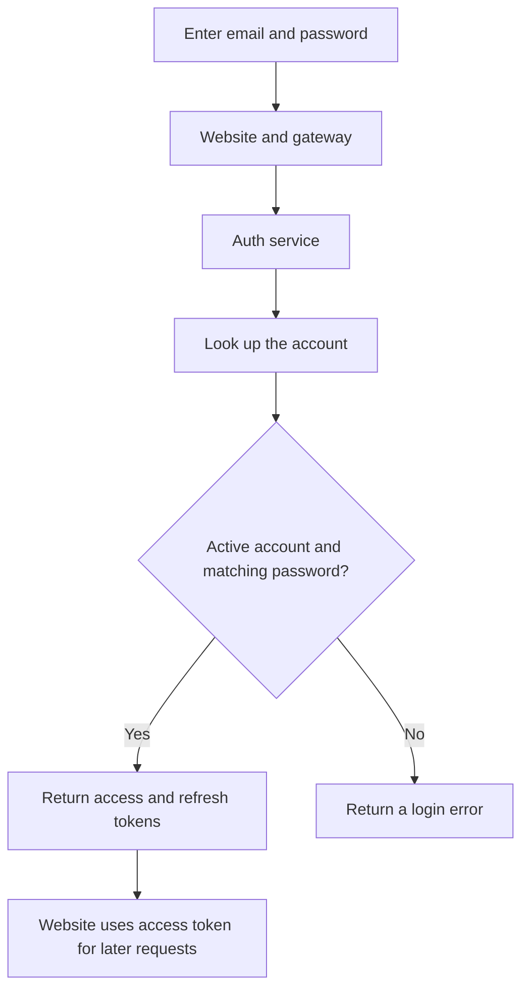

# Authentication — Accounts and login

[← Back to the project guide](../../README.md) · Port **8001** · Updated **9 September 2026**

## 1. What is this service for?

Auth checks who a user is. It creates student accounts, verifies passwords and issues the credentials the website uses after login.

**Example:** A student enters their email and password. Auth compares the password with the saved password hash. If the account is active and the password matches, it returns login tokens.

## 2. What happens inside it?



An access token is a signed login credential. Other protected services check that credential when the website asks them to do something.

## 3. What does it do today?

- Creates student accounts through public registration.
- Checks login details and whether an account is active.
- Issues access tokens and refresh tokens.
- Returns the logged-in account's details.
- Provides separate utilities to create an administrator or reset an existing administrator's password.

**What it does not do:** Public registration does not create administrators. The logout response and password reset do not currently invalidate all previously issued tokens.

## 4. Which parts does it connect to?

| Connected part | Why they connect |
| --- | --- |
| Website through gateway | Register, log in, refresh credentials and read account details |
| Database: auth area | Stores user accounts and hashed passwords |
| Protected services | Validate signed access tokens using matching JWT settings; this does not require an Auth HTTP call for every request |

## 5. What information does it save?

The **auth** database area contains the **users** table: account ID, email, name, role, active status and password hash. A password hash is a one-way password representation, not the original password text.

## 6. How do I run and check it?

### Step 1 — Start the project

Follow [the README startup steps](../../README.md#1-run-your-existing-project). Run the commands below from the main **UdaanAI** folder, with Docker Desktop and the stack running.

### Step 2 — Check this container

```powershell
docker compose ps auth-service
```

**Expected result:** the container is running. If it is exited or restarting, read its logs:

```powershell
docker compose logs --tail 80 auth-service
```

### Step 3 — Open its health page

Open [http://localhost:8001/health](http://localhost:8001/health).

**Expected result:** a small response identifying the service and its health status. This proves the process answers; it does not prove all business features or database connections work.

### Step 4 — Run its automated checks when needed

```powershell
docker compose exec auth-service python -m pytest tests -q
```

**Expected result:** a passing test summary. Run checks after relevant changes; you do not need to run them every time you open the website. Rebuild the image first if its code/dependencies changed.

Tests cover registration, login, token refresh, invalid tokens and admin-reset account preservation using isolated data. A real browser login verifies the deployed path separately.

For a configured host Python environment instead of Docker, run this from the project root:

```powershell
python -m pytest backend/auth-service/tests -q
```

Install this service's requirements in that host environment first. Host and image dependency versions can differ.

## 7. What still needs attention?

Old access and refresh tokens remain usable until expiry unless otherwise rejected. A refresh token can obtain new access tokens after a password reset. Session revocation, refresh safeguards and production signing configuration still need work.

## 8. Developer reference — read when you need more detail

You can use the website without memorizing this section.

### Main API operations

The table shows direct service paths. For browser calls through the gateway, put `/api/v1` before the business path. For example, `/auth/login` becomes `/api/v1/auth/login`. Health checks use the service port directly.

An API operation is an address the website or another service calls. **GET** usually reads data, **POST** submits an action, and **PUT/PATCH** changes data. These entries describe the implemented API; they are not all buttons shown on screen.

| Method | Direct path | Purpose |
| --- | --- | --- |
| POST | /auth/register | Register student |
| POST | /auth/login | Authenticate and issue tokens |
| POST | /auth/refresh | Exchange refresh token for access token |
| POST | /auth/logout | Logout response; no server token revocation |
| GET | /auth/me | Authenticated account lookup |
| GET | /health | Process health |

For interactive API details, open [this service's API documentation](http://localhost:8001/docs).

### Important files

All paths below are inside [backend/auth-service](../../backend/auth-service).

| File | Plain-language purpose |
| --- | --- |
| [app/api/routes/auth.py](../../backend/auth-service/app/api/routes/auth.py) | Receives login and account requests |
| [app/services/auth_service.py](../../backend/auth-service/app/services/auth_service.py) | Applies account rules |
| [app/core/security.py](../../backend/auth-service/app/core/security.py) | Hashes passwords and handles tokens |
| [app/models/user.py](../../backend/auth-service/app/models/user.py) | Describes the users table |
| [app/scripts/reset_admin_password.py](../../backend/auth-service/app/scripts/reset_admin_password.py) | Resets an existing admin password |
| [app/scripts/bootstrap_admin.py](../../backend/auth-service/app/scripts/bootstrap_admin.py) | Creates a missing admin account |

### Access tokens and refresh tokens

| Credential | What it does | Default lifetime |
| --- | --- | --- |
| Access token | Identifies a user on protected API calls | 30 minutes |
| Refresh token | Obtains a new access token | 7 days |

`JWT_SECRET_KEY` is the signing key. Token-consuming services must use the matching key and algorithm. `DATABASE_URL` tells Auth where its database is. Token lifetimes can be overridden in service settings, but the current Compose file must explicitly pass any desired override.

The frontend stores tokens in browser local storage. Password hashing uses bcrypt. The service creates its schema/table at startup and logs initialization failures; it has no Auth Alembic migration history.

### Reset an existing administrator's password

Use this only if you need a reset. Your admin browser login has already been confirmed working.

Run from the root in an interactive PowerShell terminal:

```powershell
docker exec -it udaan-auth-service python app/scripts/reset_admin_password.py
```

The script normally prompts without displaying typed characters. However, it uses `ADMIN_PASSWORD` or `--password` instead if either provides a value. The password needs at least eight characters.

It defaults to `admin@udaan.ai`; `ADMIN_EMAIL` or `--email` can choose another account. It changes only the existing admin's password hash and refuses a non-admin target.

It tries HTTP login and then an internal authenticator as a fallback. Internal success does not prove browser login. The password is already saved before verification; verification failure does not undo the reset. Authentication generates tokens, but the utility does not print them.

### Create an administrator on a fresh installation

`app/scripts/bootstrap_admin.py` uses `ADMIN_EMAIL`, `ADMIN_PASSWORD` and optional `ADMIN_NAME`. It preserves existing admins and refuses to overwrite a student account. It does not have a hidden password prompt. This is an operational setup utility, not part of the public Register page.

---

[Return to the startup guide](../../README.md#1-run-your-existing-project) · [See all service connections](../../README.md#4-see-how-the-services-connect)
