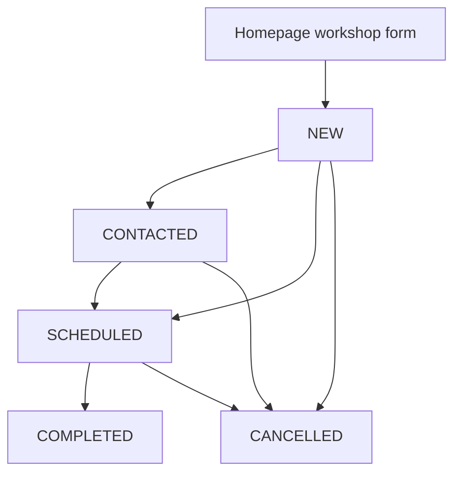

# Institutions and workshops — Requests and scheduling

[← Back to the project guide](../../README.md) · Port **8006** · Updated **9 September 2026**

## 1. What is this service for?

This service handles workshop requests from institutions and the administrator's work on those requests.

**Example:** A school submits the Request a Workshop form. The request appears as NEW in admin. An administrator can mark it Contacted, schedule it and later record completion and attendance.

## 2. What happens inside it?



COMPLETED and CANCELLED are final states. The current service has no action for reopening a cancelled request.

## 3. What does it do today?

- Accepts validated public workshop requests.
- Shows administrators request counts and lists.
- Filters requests by status, district, mode or search.
- Records contact status and confirmed schedules.
- Saves completion, attendance and feedback details.
- Cancels a request while retaining its history and reason.

**What it does not do:** It does not send an email or call an institution when Contacted is selected. It is not a general searchable institution directory. The current workshop dashboard is provided by this service, not Admin analytics.

## 4. Which parts does it connect to?

| Connected part | Why they connect |
| --- | --- |
| Public homepage | Submits workshop requests without login |
| Admin pages through gateway | Read queues and perform protected actions |
| Database: institution area | Stores requests and schedules |
| Auth token settings | Used locally to validate administrator access |

## 5. What information does it save?

**workshop_requests** stores institution/contact details, preferences and status. **workshop_schedules** stores timing, delivery mode, location/link, facilitator, notes and completion details.

## 6. How do I run and check it?

### Step 1 — Start the project

Follow [the README startup steps](../../README.md#1-run-your-existing-project). Run the commands below from the main **UdaanAI** folder, with Docker Desktop and the stack running.

### Step 2 — Check this container

```powershell
docker compose ps institution-service
```

**Expected result:** the container is running. If it is exited or restarting, read its logs:

```powershell
docker compose logs --tail 80 institution-service
```

### Step 3 — Open its health page

Open [http://localhost:8006/health](http://localhost:8006/health).

**Expected result:** a small response identifying the service and its health status. This proves the process answers; it does not prove all business features or database connections work.

### Step 4 — Run its automated checks when needed

```powershell
docker compose exec institution-service python -m pytest tests -q
```

**Expected result:** a passing test summary. Run checks after relevant changes; you do not need to run them every time you open the website. Rebuild the image first if its code/dependencies changed.

Backend tests cover public validation, admin access, legal/illegal transitions, history and tokens. Frontend admin tests check scheduling, cancellation error recovery, attendance and loading states. A separate live test should confirm status changes and attendance after refresh.

For a configured host Python environment instead of Docker, run this from the project root:

```powershell
python -m pytest backend/institution-service/tests -q
```

Install this service's requirements in that host environment first. Host and image dependency versions can differ.

## 7. What still needs attention?

Admin browser login has been confirmed, but the complete live workshop journey still needs verification. Public request rate limiting, production sessions and PostgreSQL migration/restore checks remain open.

## 8. Developer reference — read when you need more detail

You can use the website without memorizing this section.

### Main API operations

The table shows direct service paths. For browser calls through the gateway, put `/api/v1` before the business path. For example, `/auth/login` becomes `/api/v1/auth/login`. Health checks use the service port directly.

An API operation is an address the website or another service calls. **GET** usually reads data, **POST** submits an action, and **PUT/PATCH** changes data. These entries describe the implemented API; they are not all buttons shown on screen.

| Method | Direct path | Purpose |
| --- | --- | --- |
| POST | /workshops/requests | Public request |
| GET | /workshops/admin/overview | Counts and queues |
| GET | /workshops/admin/requests | List/filter by status, district, mode or search |
| GET | /workshops/admin/requests/{request_id} | Request/schedule detail |
| POST | /workshops/admin/requests/{request_id}/contact | Mark contacted |
| POST | /workshops/admin/requests/{request_id}/schedule | Schedule nonterminal request |
| PATCH | /workshops/admin/requests/{request_id}/schedule | Edit nonterminal schedule |
| POST | /workshops/admin/requests/{request_id}/complete | Complete and record attendance |
| POST | /workshops/admin/requests/{request_id}/cancel | Cancel with reason |
| GET | /health | Process health |

For interactive API details, open [this service's API documentation](http://localhost:8006/docs).

### Important files

All paths below are inside [backend/institution-service](../../backend/institution-service).

| File | Plain-language purpose |
| --- | --- |
| [app/api/routes/workshops.py](../../backend/institution-service/app/api/routes/workshops.py) | Receives public and admin requests |
| [app/services/workshop_service.py](../../backend/institution-service/app/services/workshop_service.py) | Enforces lifecycle rules |
| [app/schemas/workshop.py](../../backend/institution-service/app/schemas/workshop.py) | Validates form fields and actions |
| [app/core/security.py](../../backend/institution-service/app/core/security.py) | Requires an administrator for protected actions |
| [app/models/workshop.py](../../backend/institution-service/app/models/workshop.py) | Describes requests and schedules |

### What to do when the admin queue is empty

1. Open the public homepage in a second tab.
2. Click **Request a Workshop**.
3. Submit clearly labelled test institution details.
4. Return to admin and click **Refresh Data**.
5. Open the request and test scheduling/completion.
6. Submit a separate request to test cancellation.

A zero count can mean the queue is truly empty. It does not necessarily mean the admin login failed.

### Rules that affect testing

- Requests start NEW.
- Marking Contacted changes NEW to CONTACTED; repeating it is harmless.
- Scheduling creates or updates the schedule of a nonterminal request.
- Completion requires SCHEDULED and an existing schedule.
- Completed or cancelled requests cannot be scheduled or cancelled again.
- Cancellation requires a reason and preserves the record.

Database/JWT settings must match the other services. `main.py` does not create tables automatically. Prepare the existing initial workshop migration against a checked database state before using a fresh installation.

---

[Return to the startup guide](../../README.md#1-run-your-existing-project) · [See all service connections](../../README.md#4-see-how-the-services-connect)
