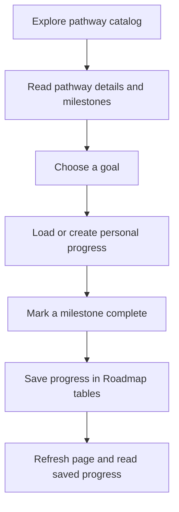

# Roadmaps — Education paths and student progress

[← Back to the project guide](../../README.md) · Port **8005** · Updated **9 September 2026**

## 1. What is this service for?

The Roadmap service provides the pathway catalog and remembers which goal a student has selected and how far they have progressed.

**Example:** A student opens a pathway, reads its steps and chooses it as a goal. When they mark a milestone complete, the service saves that progress so it can appear again after a refresh.

## 2. What happens inside it?



Catalog content describes the available routes. Personal progress records what a specific student has chosen and completed.

## 3. What does it do today?

- Lists pathways and their options/milestones.
- Filters pathways by education level, stream or requested IDs.
- Creates or selects a student's goal.
- Preserves progress when the same pathway is selected again.
- Keeps goal history when the student switches pathways.
- Checks ownership before changing milestone progress.

**What it does not do:** The catalog does not prove current admission eligibility. Its educational claims and pathway relationships still need source review.

## 4. Which parts does it connect to?

| Connected part | Why they connect |
| --- | --- |
| Pathways and My Career Roadmap pages | Browse content, select goals and update progress |
| Recommendation service | Reads pathway metadata |
| Database: roadmap area | Stores catalog and personal progress |

## 5. What information does it save?

**pathways**, **pathway_options** and **pathway_milestones** store the catalog. **student_goals** and **student_milestone_progress** store each student's choices and progress. The source catalog lives in app/db/seed_pathways.py.

## 6. How do I run and check it?

### Step 1 — Start the project

Follow [the README startup steps](../../README.md#1-run-your-existing-project). Run the commands below from the main **UdaanAI** folder, with Docker Desktop and the stack running.

### Step 2 — Check this container

```powershell
docker compose ps roadmap-service
```

**Expected result:** the container is running. If it is exited or restarting, read its logs:

```powershell
docker compose logs --tail 80 roadmap-service
```

### Step 3 — Open its health page

Open [http://localhost:8005/health](http://localhost:8005/health).

**Expected result:** a small response identifying the service and its health status. This proves the process answers; it does not prove all business features or database connections work.

### Step 4 — Run its automated checks when needed

```powershell
docker compose exec roadmap-service python -m pytest tests -q
```

**Expected result:** a passing test summary. Run checks after relevant changes; you do not need to run them every time you open the website. Rebuild the image first if its code/dependencies changed.

Tests cover filtering, database relationships, seed behavior, progress preservation, completion, ownership and competing changes. Verify PostgreSQL concurrency and migrations separately; temporary test databases do not establish those guarantees.

For a configured host Python environment instead of Docker, run this from the project root:

```powershell
python -m pytest backend/roadmap-service/tests -q
```

Install this service's requirements in that host environment first. Host and image dependency versions can differ.

## 7. What still needs attention?

Existing-table initialization and migration history can disagree and need reconciliation. Educational content needs review. Live progress after refresh and goal switching should be checked as part of the student journey.

## 8. Developer reference — read when you need more detail

You can use the website without memorizing this section.

### Main API operations

The table shows direct service paths. For browser calls through the gateway, put `/api/v1` before the business path. For example, `/auth/login` becomes `/api/v1/auth/login`. Health checks use the service port directly.

An API operation is an address the website or another service calls. **GET** usually reads data, **POST** submits an action, and **PUT/PATCH** changes data. These entries describe the implemented API; they are not all buttons shown on screen.

| Method | Direct path | Purpose |
| --- | --- | --- |
| GET | /roadmaps/pathways | Catalog with level, stream and ID filters |
| GET | /roadmaps/pathways/{pathway_id} | Pathway, options and milestones |
| POST | /roadmaps/goals | Select personal pathway goal |
| GET | /roadmaps/goals/me | Current/displayed goal and progress |
| PATCH | /roadmaps/goals/me/milestones/{milestone_id} | Update own progress |
| GET | /health | Process health |

For interactive API details, open [this service's API documentation](http://localhost:8005/docs).

### Important files

All paths below are inside [backend/roadmap-service](../../backend/roadmap-service).

| File | Plain-language purpose |
| --- | --- |
| [app/api/routes/roadmap.py](../../backend/roadmap-service/app/api/routes/roadmap.py) | Receives catalog and goal requests |
| [app/services/roadmap_service.py](../../backend/roadmap-service/app/services/roadmap_service.py) | Handles catalog, goals and progress |
| [app/models/pathway.py](../../backend/roadmap-service/app/models/pathway.py) | Describes catalog and progress tables |
| [app/db/seed_pathways.py](../../backend/roadmap-service/app/db/seed_pathways.py) | Stores initial pathway content |
| [alembic/versions/006_add_unique_active_goal_index.py](../../backend/roadmap-service/alembic/versions/006_add_unique_active_goal_index.py) | Enforces one ACTIVE goal per student |

### Why both seeds and migrations are needed

A migration changes the database's structure. A seed loads pathway content into that structure. They are not duplicates.

This service has six migration revisions:

1. Initial pathway tables.
2. Student goals and milestone progress.
3. Parent-child pathway relationships.
4. Recommendation dimensions.
5. Whether a milestone is active.
6. A database rule permitting only one ACTIVE goal per student.

Revision 006 stops if duplicate ACTIVE goals already exist. Resolve those records intentionally while preserving history; do not discard data to force the migration through.

Startup attempts schema/table creation and catalog seeding. An explicit seed command, used only after reviewing data changes, is:

```powershell
docker compose exec roadmap-service python -m app.db.seed_runner
```

Configuration includes database/JWT settings. The standalone fallback JWT key differs from Auth's, so set a shared key when running outside Docker. Compose supplies the matching key.

Catalog API reads are public. Goal/progress operations require access-token ownership checks.

---

[Return to the startup guide](../../README.md#1-run-your-existing-project) · [See all service connections](../../README.md#4-see-how-the-services-connect)
