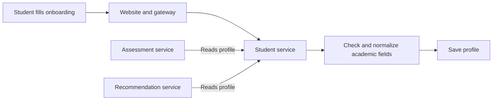

# Student profiles — Academic information

[← Back to the project guide](../../README.md) · Port **8002** · Updated **9 September 2026**

## 1. What is this service for?

This service remembers the student's academic context so the website can show relevant questions and education options.

**Example:** A student selects PUC Science during onboarding. This service saves that stage and stream. The Assessment service later reads those details to choose the appropriate questionnaire.

## 2. What happens inside it?



The profile is shared through service calls, so the student does not need to enter the same academic information on every screen.

## 3. What does it do today?

- Saves and returns the current user's profile.
- Normalizes academic details such as stream, Diploma branch or ITI trade.
- Calculates profile completeness.
- Handles general profile edits and academic-stage changes through different operations.

**What it does not do:** It does not ask the interest questions or generate career suggestions. Saving a preferred language also does not translate the website by itself.

## 4. Which parts does it connect to?

| Connected part | Why they connect |
| --- | --- |
| Onboarding, dashboard and profile editing | Create, display or update academic details |
| Assessment service | Reads the profile to choose questions |
| Recommendation service | Reads the profile to choose a pathway group |
| Database: student area | Stores profiles |

## 5. What information does it save?

The **student_profiles** table stores user ID, name, academic level/year, board, stream or trade/branch, institution, location and preferred language. Profile responses also include whether the required fields are complete.

## 6. How do I run and check it?

### Step 1 — Start the project

Follow [the README startup steps](../../README.md#1-run-your-existing-project). Run the commands below from the main **UdaanAI** folder, with Docker Desktop and the stack running.

### Step 2 — Check this container

```powershell
docker compose ps student-service
```

**Expected result:** the container is running. If it is exited or restarting, read its logs:

```powershell
docker compose logs --tail 80 student-service
```

### Step 3 — Open its health page

Open [http://localhost:8002/health](http://localhost:8002/health).

**Expected result:** a small response identifying the service and its health status. This proves the process answers; it does not prove all business features or database connections work.

### Step 4 — Run its automated checks when needed

```powershell
docker compose exec student-service python -m pytest tests -q
```

**Expected result:** a passing test summary. Run checks after relevant changes; you do not need to run them every time you open the website. Rebuild the image first if its code/dependencies changed.

Tests cover profile creation/updates, academic-field transitions and invalid tokens. For a live check, update a profile, refresh the page and confirm the details remain. Then check the assigned assessment after a stage change.

For a configured host Python environment instead of Docker, run this from the project root:

```powershell
python -m pytest backend/student-service/tests -q
```

Install this service's requirements in that host environment first. Host and image dependency versions can differ.

## 7. What still needs attention?

Creation and update validation are not equally strict yet. Changing a profile does not automatically regenerate historical recommendations. Kannada translation and consistent stale-result handling remain work.

## 8. Developer reference — read when you need more detail

You can use the website without memorizing this section.

### Main API operations

The table shows direct service paths. For browser calls through the gateway, put `/api/v1` before the business path. For example, `/auth/login` becomes `/api/v1/auth/login`. Health checks use the service port directly.

An API operation is an address the website or another service calls. **GET** usually reads data, **POST** submits an action, and **PUT/PATCH** changes data. These entries describe the implemented API; they are not all buttons shown on screen.

| Method | Direct path | Purpose |
| --- | --- | --- |
| POST | /students/profile | Create or replace own profile details |
| GET | /students/profile/me | Read own profile |
| PUT | /students/profile/me | Update general details |
| PUT | /students/profile/academic-stage | Change academic stage and related fields |
| GET | /health | Process health |

For interactive API details, open [this service's API documentation](http://localhost:8002/docs).

### Important files

All paths below are inside [backend/student-service](../../backend/student-service).

| File | Plain-language purpose |
| --- | --- |
| [app/api/routes/student.py](../../backend/student-service/app/api/routes/student.py) | Receives profile requests |
| [app/schemas/student_profile.py](../../backend/student-service/app/schemas/student_profile.py) | Defines accepted profile fields |
| [app/services/student_service.py](../../backend/student-service/app/services/student_service.py) | Validates stages and computes completeness |
| [app/models/student_profile.py](../../backend/student-service/app/models/student_profile.py) | Describes stored profile data |

### Two types of update

| Change | Operation to use |
| --- | --- |
| General details such as institution or district | Update profile |
| Class/stage, stream, Diploma branch or ITI trade | Update academic stage |

The general update endpoint rejects academic fields. `POST /students/profile` can create or replace the current profile's details.

Configuration uses `DATABASE_URL`, `DB_SCHEMA` and shared JWT settings. The service checks the user's access token and works with that user's ID.

There is one initial Alembic migration. Startup also creates tables and adds certain academic columns when missing. Those files have different purposes: migrations record versioned changes; startup initialization is an existing convenience mechanism. Inspect existing database tables and migration history before applying upgrades.

---

[Return to the startup guide](../../README.md#1-run-your-existing-project) · [See all service connections](../../README.md#4-see-how-the-services-connect)
